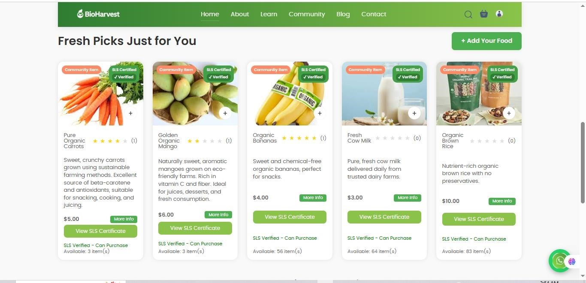
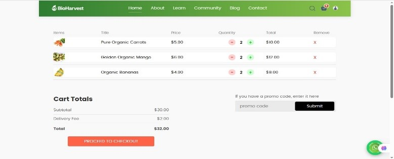
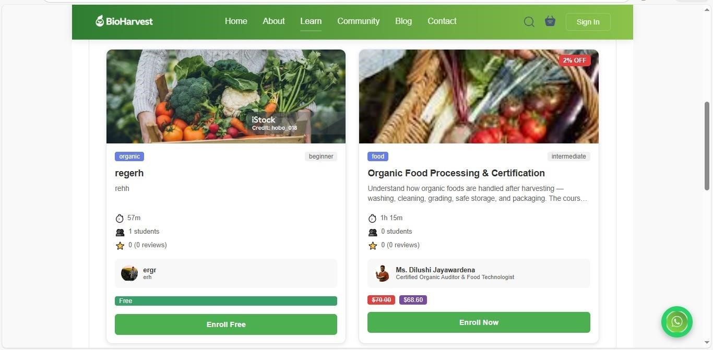
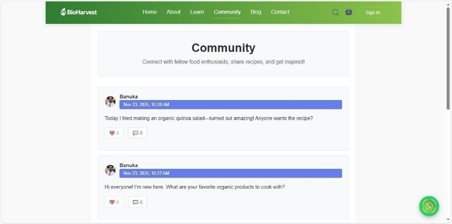
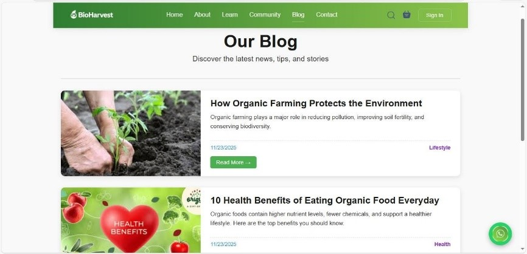
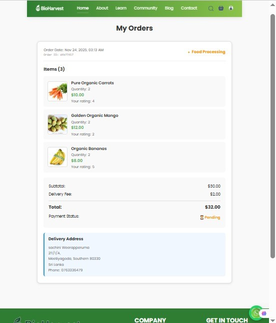
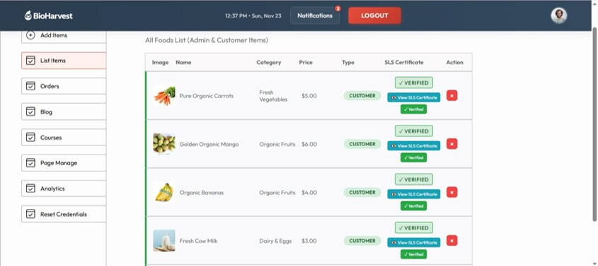
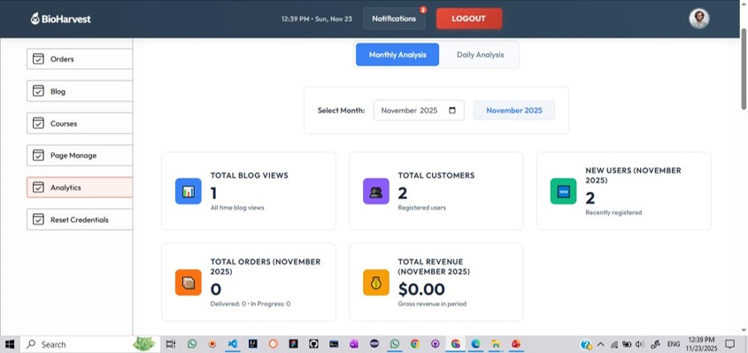
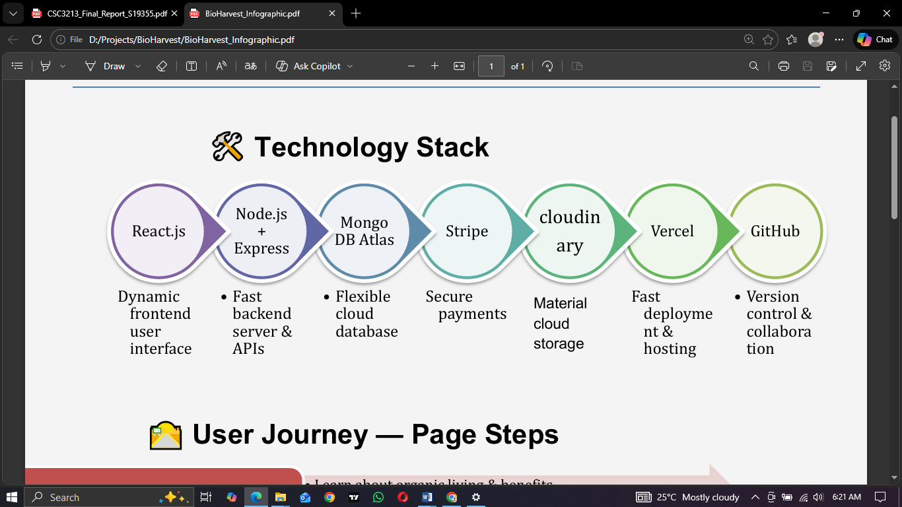

# BioHarvest – Organic Lifestyle & Learning Platform

BioHarvest is a **full-stack MERN web application** focused on promoting **organic living, healthy lifestyles, and sustainable food practices**.  
The platform educates users on organic food, enables community engagement, and allows buying and selling of **admin-verified organic products**.

---

## 📌 Project Background

In today’s fast-paced world, food production prioritizes quantity over quality. The excessive use of chemicals, pesticides, and artificial enhancers has contributed to serious health issues such as **diabetes, cholesterol, and high blood pressure**.

BioHarvest was developed as an **innovative solution** to:
- Educate people about organic food and healthy living
- Improve access to clean, chemical-free produce
- Encourage sustainable farming practices
- Bridge the gap between health education and daily lifestyle habits

---

## 📌 Project Objectives

- Promote awareness of organic food and sustainable agriculture
- Provide learning resources for organic farming and healthy living
- Enable safe buying and selling of verified organic products
- Build an interactive community for knowledge sharing
- Support healthier lifestyle choices through technology

---

## 📌 System Architecture

BioHarvest follows the **MERN Stack Architecture**:

- **Frontend**: React.js (Vite)
- **Backend**: Node.js + Express.js
- **Database**: MongoDB Atlas
- **Cloud Storage**: Cloudinary (images, PDFs, documents)
- **Payment Gateway**: Stripe
- **Authentication**: JWT & bcrypt

  
---

## 📌 User Roles

### 📌 Client (Buyer / Learner / Seller)
- User registration & authentication
- Explore admin-verified organic food
- Add products to cart & place orders
- Secure online payments (Stripe)
- Enroll in organic learning courses
- Access PDFs & learning materials
- Participate in community discussions
- Manage profile & order history

### 📌 Admin
- Verify organic products and sellers
- Manage users and content
- Approve certifications and courses
- Monitor platform activities

---

## 📌 Core Features

### 📌 Home Page
- Hero section promoting organic lifestyle
- Featured organic products
- Navigation to Learn, Explore, and Community

### 📌 Marketplace
- Organic food categories
- Admin-verified products
- Cart & order management
- Secure checkout with Stripe

### 📌 Learn & Grow
- Organic education courses
- Downloadable PDF materials
- Course enrollment & tracking

### 📌 Community Forum
- Create posts & comments
- Like and react to discussions
- Knowledge sharing platform

### 📌 Blogs
- Organic lifestyle blogs
- Detailed blog view pages

### 📌 Contact & Support
- Contact form
- WhatsApp live chat integration

---
---

## 📌 Testing & Validation

- API testing using Postman
- CRUD operation testing
- Payment flow testing (Stripe)
- Responsive UI testing
- Error handling & validation checks

---
---

## 📸 Screenshots (Click to Zoom)

<table>
  <tr>
    <td align="center">
      <b>Home Page</b> 
      
    </td>
    <td align="center">
      <b>Explore Menu</b> 
      
    </td>
  </tr>

  <tr>
    <td align="center">
      <b>Cart Page</b> 
      
    </td>
    <td align="center">
      <b>Learning Page</b> 
      
    </td>
  </tr>

  <tr>
    <td align="center">
      <b>Community</b> 
      
    </td>
    <td align="center">
      <b>Blog Interfaces</b> 
      
    </td>
  </tr>

  <tr>
    <td align="center">
      <b>Order History</b> 
      
    </td>
    <td align="center">
      <b>Certificate Verification</b> 
      
    </td>
  </tr>

  <tr>
    <td align="center">
      <b>Admin Analysis Usage</b> 
      
    </td>
    <td align="center">
      <b>System Architecture</b> 
      
    </td>
  </tr>
</table>
